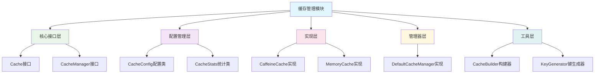

# 缓存管理模块重构设计方案

## 设计原则

1. **规范性**：遵循标准缓存API设计模式
2. **通用性**：适用于各类Java项目，不限于特定框架
3. **易用性**：提供简洁直观的API接口
4. **可靠性**：具备完善的错误处理和资源管理机制
5. **最小依赖**：减少第三方库依赖，降低集成成本
6. **优雅性**：采用现代化Java编程风格

## 核心架构设计

### 1. 模块分层结构




### 2. 核心接口层设计

#### Cache接口

```java
/**
 * 统一缓存接口
 * @param <K> 键类型
 * @param <V> 值类型
 */
public interface Cache<K, V> extends AutoCloseable {
    // 基本操作
    V get(K key);
    void put(K key, V value);
    boolean remove(K key);
    
    // 批量操作
    Map<K, V> getAll(Set<? extends K> keys);
    void putAll(Map<? extends K, ? extends V> map);
    void removeAll(Set<? extends K> keys);
    
    // 高级功能
    V getOrLoad(K key, Function<K, V> loader);
    void put(K key, V value, long ttl, TimeUnit unit);
    
    // 管理方法
    CacheStats getStats();
    long size();
    void clear();
    void refresh();
    
    // 生命周期
    @Override
    void close();
}
```


#### CacheManager接口

```java
/**
 * 缓存管理器接口
 */
public interface CacheManager extends AutoCloseable {
    <K, V> Cache<K, V> createCache(String name, CacheConfig config);
    <K, V> Cache<K, V> getCache(String name);
    void removeCache(String name);
    Collection<String> getCacheNames();
    CacheManagerStats getStats();
    
    @Override
    void close();
}
```


### 3. 配置管理层设计

#### CacheConfig配置类

```java
/**
 * 缓存配置类
 */
public class CacheConfig {
    private String name;
    private long maximumSize = 1000;
    private long expireAfterWrite = 0;
    private long expireAfterAccess = 0;
    private boolean recordStats = false;
    private BackendType backendType = BackendType.MEMORY;
    
    // 缓存保护配置
    private boolean nullValueProtection = false;
    private boolean breakdownProtection = false;
    private boolean avalancheProtection = false;
    
    // Getters and Setters...
}
```


#### BackendType枚举

```java
/**
 * 缓存后端类型
 */
public enum BackendType {
    MEMORY,      // 内存缓存
    CAFFEINE     // Caffeine缓存
}
```


### 4. 实现层设计

#### CaffeineCache实现

```java
/**
 * 基于Caffeine的缓存实现
 */
public class CaffeineCache<K, V> implements Cache<K, V> {
    private final com.github.benmanes.caffeine.cache.Cache<K, Object> cache;
    private final CacheConfig config;
    private final CacheStats stats = new CacheStats();
    
    public CaffeineCache(CacheConfig config) {
        this.config = config;
        this.cache = buildCache(config);
    }
    
    // 实现Cache接口方法...
}
```


#### MemoryCache实现

```java
/**
 * 基于内存的简单缓存实现
 */
public class MemoryCache<K, V> implements Cache<K, V> {
    private final Map<K, ExpiringValue<V>> cache = new ConcurrentHashMap<>();
    private final CacheConfig config;
    private final CacheStats stats = new CacheStats();
    private final ScheduledExecutorService cleanupScheduler;
    
    public MemoryCache(CacheConfig config) {
        this.config = config;
        if (config.getCleanupInterval() > 0) {
            this.cleanupScheduler = Executors.newSingleThreadScheduledExecutor();
            this.cleanupScheduler.scheduleWithFixedDelay(
                this::cleanup, 
                config.getCleanupInterval(), 
                config.getCleanupInterval(), 
                TimeUnit.MILLISECONDS
            );
        } else {
            this.cleanupScheduler = null;
        }
    }
    
    // 实现Cache接口方法...
}
```


### 5. 管理器层设计

#### DefaultCacheManager实现

```java
/**
 * 默认缓存管理器实现
 */
public class DefaultCacheManager implements CacheManager {
    private final Map<String, Cache<?, ?>> caches = new ConcurrentHashMap<>();
    private final CopyOnWriteArraySet<String> cacheNames = new CopyOnWriteArraySet<>();
    
    @Override
    public <K, V> Cache<K, V> createCache(String name, CacheConfig config) {
        if (name == null || name.isEmpty()) {
            throw new IllegalArgumentException("Cache name cannot be null or empty");
        }
        
        if (caches.containsKey(name)) {
            throw new IllegalStateException("Cache with name '" + name + "' already exists");
        }
        
        Cache<K, V> cache = CacheFactory.create(config);
        caches.put(name, cache);
        cacheNames.add(name);
        return cache;
    }
    
    // 实现其他接口方法...
}
```


### 6. 工具层设计

#### CacheBuilder构建器

```java
/**
 * 缓存构建器
 */
public class CacheBuilder {
    private final CacheConfig config = new CacheConfig();
    
    public static CacheBuilder newBuilder() {
        return new CacheBuilder();
    }
    
    public CacheBuilder name(String name) {
        config.setName(name);
        return this;
    }
    
    public CacheBuilder maximumSize(long maximumSize) {
        config.setMaximumSize(maximumSize);
        return this;
    }
    
    public CacheBuilder expireAfterWrite(long duration, TimeUnit unit) {
        config.setExpireAfterWrite(unit.toMillis(duration));
        return this;
    }
    
    public CacheBuilder recordStats(boolean record) {
        config.setRecordStats(record);
        return this;
    }
    
    public <K, V> Cache<K, V> build() {
        switch (config.getBackendType()) {
            case MEMORY:
                return new MemoryCache<>(config);
            case CAFFEINE:
                return new CaffeineCache<>(config);
            default:
                throw new UnsupportedOperationException("Unsupported backend type: " + config.getBackendType());
        }
    }
}
```


#### CacheFactory工厂

```java
/**
 * 缓存工厂类
 */
public class CacheFactory {
    public static <K, V> Cache<K, V> create(CacheConfig config) {
        Cache<K, V> cache;
        switch (config.getBackendType()) {
            case MEMORY:
                cache = new MemoryCache<>(config);
                break;
            case CAFFEINE:
                cache = new CaffeineCache<>(config);
                break;
            default:
                throw new IllegalArgumentException("Unsupported backend type: " + config.getBackendType());
        }
        
        // 如果启用了保护机制，包装为ProtectedCache
        if (config.isNullValueProtection() || 
            config.isBreakdownProtection() || 
            config.isAvalancheProtection()) {
            cache = new ProtectedCache<>(cache, config);
        }
        
        return cache;
    }
}
```


## 改进要点

### 1. 简化依赖
- 移除Spring相关注解和实现
- 保留必要依赖（如Caffeine、SLF4J）
- 将可选依赖标记为optional

### 2. 统一接口设计
- 所有资源接口继承`AutoCloseable`
- 规范异常处理机制
- 统一命名规范

### 3. 增强可靠性
- 完善资源管理和自动关闭机制
- 统一异常处理策略
- 加强线程安全性

### 4. 提升易用性
- 提供流畅的构建器模式
- 简化配置过程
- 提供合理的默认值

### 5. 优化性能
- 减少不必要的对象创建
- 优化统计信息收集
- 提供高效的缓存清理机制

这个重构方案保持了原有功能的同时，更加专注于非Spring Boot项目的使用场景，简化了依赖关系，提高了模块的独立性和易用性。