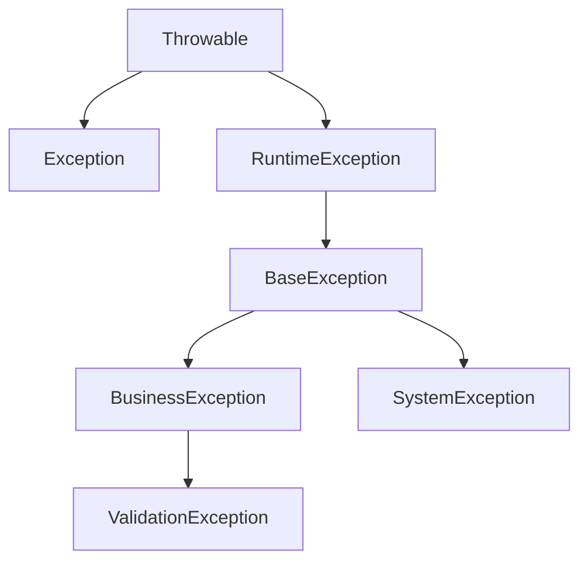

# QTech 通用异常处理体系使用手册

## 1. 简介

QTech 通用异常处理体系是一套完整、规范、可扩展的企业级异常处理解决方案。该体系提供了统一的异常层次结构、灵活的异常处理机制、规范化的错误码管理以及专业的异常处理工具。

## 2. 核心组件

### 2.1 异常层次结构




### 2.2 核心类说明

| 类名 | 说明 | 用途 |
|------|------|------|
| [BaseException](file://E:\dossier\others\im-common\src\main\java\com\qtech\im\exception\BaseException.java#L11-L64) | 基础异常类 | 所有自定义异常的基类 |
| [BusinessException](file://E:\dossier\others\im-common\src\main\java\com\qtech\im\exception\BusinessException.java#L11-L25) | 业务异常类 | 处理业务逻辑层面的异常 |
| [SystemException](file://E:\dossier\others\im-common\src\main\java\com\qtech\im\exception\SystemException.java#L11-L25) | 系统异常类 | 处理系统技术层面的异常 |
| [ValidationException](file://E:\dossier\others\im-common\src\main\java\com\qtech\im\exception\ValidationException.java#L13-L63) | 校验异常类 | 处理参数校验失败的情况 |
| [ExceptionUtils](file://E:\dossier\others\im-common\src\main\java\com\qtech\im\util\ExceptionUtils.java#L19-L110) | 异常工具类 | 提供异常处理的工具方法 |
| [GlobalExceptionHandler](file://E:\dossier\others\im-common\src\main\java\com\qtech\im\handler\GlobalExceptionHandler.java#L18-L122) | 全局异常处理器 | 统一处理系统中的异常 |

## 3. 快速开始

### 3.1 添加依赖

在项目中添加必要的依赖：

```xml
<dependency>
    <groupId>com.qtech</groupId>
    <artifactId>im-common</artifactId>
    <version>1.0.0</version>
</dependency>
```


### 3.2 基本使用

```java
import com.qtech.exception.BusinessException;

public class UserService {
    public User getUserById(String userId) {
        if (userId == null || userId.isEmpty()) {
            throw new BusinessException("BIZ_PARAM_INVALID", "用户ID不能为空");
        }
        
        User user = userRepository.findById(userId);
        if (user == null) {
            throw new BusinessException("BIZ_DATA_NOT_FOUND", "用户不存在");
        }
        
        return user;
    }
}
```


## 4. 详细使用指南

### 4.1 异常类使用

#### BaseException 基础异常

```java
// 基本用法
throw new BaseException("ERROR_CODE", "错误信息");

// 带原因的异常
throw new BaseException("ERROR_CODE", "错误信息", cause);

// 带详细信息的异常
Map<String, Object> details = new HashMap<>();
details.put("field", "value");
throw new BaseException("ERROR_CODE", "错误信息", details, cause);
```


#### BusinessException 业务异常

```java
// 业务逻辑异常
throw new BusinessException("BIZ_DATA_NOT_FOUND", "数据不存在");

// 带详细信息的业务异常
List<String> missingFields = Arrays.asList("name", "email");
throw new BusinessException("BIZ_PARAM_INVALID", "缺少必要参数", missingFields, null);
```


#### SystemException 系统异常

```java
// 系统级异常
throw new SystemException("SYS_IO_ERROR", "系统IO异常");

// 带原因的系统异常
try {
    // 某个操作
} catch (IOException e) {
    throw new SystemException("SYS_IO_ERROR", "文件读取失败", e);
}
```


#### ValidationException 校验异常

```java
// 参数校验异常
List<ValidationError> errors = new ArrayList<>();
errors.add(new ValidationError("email", "邮箱格式不正确", "invalid-email"));
errors.add(new ValidationError("age", "年龄必须大于0", -1));

throw new ValidationException("BIZ_PARAM_INVALID", "参数校验失败", errors);
```


### 4.2 异常工具类使用

#### 包装受检异常

```java
import com.qtech.util.ExceptionUtils;

// 将受检异常包装为运行时异常
String content = ExceptionUtils.wrapCheckedException(() -> {
    return Files.readString(Paths.get("file.txt"));
});
```


#### 安全执行操作

```java
// 安全执行可能失败的操作
ExceptionUtils.safeExecute(() -> {
    // 可能失败的操作
    riskyOperation();
}, "执行风险操作时发生异常");
```


#### 异常转换

```java
// 转换异常类型
IOException ioException = new IOException("IO异常");
BusinessException businessException = ExceptionUtils.convertException(
    ioException, 
    e -> new BusinessException("BIZ_OPERATION_FAILED", "操作失败", e)
);
```


### 4.3 全局异常处理

#### 注册自定义异常处理器

```java
import com.qtech.handler.GlobalExceptionHandler;
import com.qtech.handler.ExceptionHandler;

// 获取全局异常处理器实例
GlobalExceptionHandler handler = GlobalExceptionHandler.getInstance();

// 注册自定义处理器
handler.registerHandler(IllegalArgumentException.class, (exception, context) -> {
    return new BusinessException("BIZ_PARAM_INVALID", "参数不合法: " + exception.getMessage());
});
```


#### 处理异常

```java
try {
    // 可能抛出异常的操作
    performOperation();
} catch (Throwable e) {
    // 构建上下文信息
    Map<String, Object> context = new HashMap<>();
    context.put("userId", getCurrentUserId());
    context.put("operation", "performOperation");
    
    // 使用全局异常处理器处理
    BaseException handledException = GlobalExceptionHandler.getInstance()
            .handleException(e, context);
    
    // 处理结果
    log.error("操作失败: {}", handledException.getErrorMessage(), handledException);
}
```


## 5. 错误码管理

### 5.1 预定义错误码

系统预定义了常用的错误码，按照功能模块分类：

#### 系统级错误码 (SYS_xxx)
- `SYS_UNKNOWN_ERROR`: 系统未知错误
- `SYS_CONFIG_ERROR`: 系统配置错误
- `SYS_INIT_ERROR`: 系统初始化失败
- `SYS_IO_ERROR`: 系统IO异常
- `SYS_NETWORK_ERROR`: 网络连接异常

#### 业务级错误码 (BIZ_xxx)
- `BIZ_PARAM_INVALID`: 参数校验失败
- `BIZ_DATA_NOT_FOUND`: 数据不存在
- `BIZ_DATA_EXISTS`: 数据已存在
- `BIZ_PERMISSION_DENIED`: 权限不足
- `BIZ_OPERATION_NOT_ALLOWED`: 操作不被允许

#### 认证授权错误码 (AUTH_xxx)
- `AUTH_LOGIN_FAILED`: 登录失败
- `AUTH_TOKEN_EXPIRED`: 认证令牌已过期
- `AUTH_TOKEN_INVALID`: 认证令牌无效
- `AUTH_ACCESS_DENIED`: 访问被拒绝

#### 数据库错误码 (DB_xxx)
- `DB_CONNECTION_FAILED`: 数据库连接失败
- `DB_QUERY_ERROR`: 数据库查询异常
- `DB_UPDATE_ERROR`: 数据库更新异常

#### 第三方服务错误码 (EXT_xxx)
- `EXT_SERVICE_UNAVAILABLE`: 第三方服务不可用
- `EXT_SERVICE_TIMEOUT`: 第三方服务调用超时
- `EXT_SERVICE_ERROR`: 第三方服务调用异常

### 5.2 自定义错误码

```java
// 在项目中定义自定义错误码
public interface CustomErrorCode {
    String CUSTOM_ERROR_001 = "CUSTOM_001";
    String CUSTOM_ERROR_002 = "CUSTOM_002";
}

public interface CustomErrorMessage {
    String CUSTOM_ERROR_001 = "自定义错误1";
    String CUSTOM_ERROR_002 = "自定义错误2";
}
```


## 6. 最佳实践

### 6.1 异常抛出原则

1. **明确异常类型**: 根据异常性质选择合适的异常类型
2. **提供有意义的错误信息**: 错误信息应清晰描述问题
3. **包含必要的上下文信息**: 有助于问题定位和解决
4. **避免异常链过长**: 控制异常嵌套层数

### 6.2 异常处理原则

1. **早抛出，晚捕获**: 在问题发生时立即抛出异常，在合适的层级捕获处理
2. **分类处理**: 根据异常类型采取不同的处理策略
3. **记录日志**: 重要异常应记录详细日志
4. **用户友好**: 对外暴露的异常信息应用户友好

### 6.3 示例代码

```java
@Service
public class UserService {
    
    private static final Logger logger = LoggerFactory.getLogger(UserService.class);
    
    public User createUser(CreateUserRequest request) {
        try {
            // 参数校验
            validateCreateUserRequest(request);
            
            // 检查用户是否已存在
            if (userRepository.existsByEmail(request.getEmail())) {
                throw new BusinessException("BIZ_DATA_EXISTS", "用户邮箱已存在");
            }
            
            // 创建用户
            User user = new User();
            user.setName(request.getName());
            user.setEmail(request.getEmail());
            user.setCreatedAt(new Date());
            
            return userRepository.save(user);
            
        } catch (BusinessException e) {
            // 业务异常直接抛出
            logger.warn("创建用户失败: {}", e.getErrorMessage());
            throw e;
        } catch (Exception e) {
            // 系统异常转换后抛出
            logger.error("创建用户时发生系统异常", e);
            throw new SystemException("SYS_UNKNOWN_ERROR", "创建用户失败", e);
        }
    }
    
    private void validateCreateUserRequest(CreateUserRequest request) {
        List<ValidationError> errors = new ArrayList<>();
        
        if (StringUtils.isBlank(request.getName())) {
            errors.add(new ValidationError("name", "用户名不能为空"));
        }
        
        if (StringUtils.isBlank(request.getEmail())) {
            errors.add(new ValidationError("email", "邮箱不能为空"));
        } else if (!isValidEmail(request.getEmail())) {
            errors.add(new ValidationError("email", "邮箱格式不正确", request.getEmail()));
        }
        
        if (!errors.isEmpty()) {
            throw new ValidationException("BIZ_PARAM_INVALID", "参数校验失败", errors);
        }
    }
    
    private boolean isValidEmail(String email) {
        // 邮箱格式校验逻辑
        return email.contains("@");
    }
}
```


## 7. 扩展功能

### 7.1 自定义异常处理器

```java
// 创建自定义异常处理器
public class CustomExceptionHandler implements ExceptionHandler<CustomException> {
    @Override
    public BaseException handle(CustomException exception, Map<String, Object> context) {
        // 自定义处理逻辑
        return new BusinessException("CUSTOM_ERROR", "自定义错误信息", exception);
    }
}

// 注册处理器
GlobalExceptionHandler.getInstance()
    .registerHandler(CustomException.class, new CustomExceptionHandler());
```


### 7.2 异常上下文信息

```java
// 在处理异常时添加上下文信息
Map<String, Object> context = new HashMap<>();
context.put("userId", currentUser.getId());
context.put("requestId", requestId);
context.put("timestamp", System.currentTimeMillis());

BaseException handledException = GlobalExceptionHandler.getInstance()
        .handleException(originalException, context);
```


## 8. 注意事项

1. **异常性能**: 频繁抛出异常会影响系统性能，应合理使用
2. **异常信息安全性**: 避免在异常信息中暴露敏感信息
3. **异常处理一致性**: 在整个系统中保持异常处理的一致性
4. **监控和告警**: 重要异常应接入监控和告警系统

## 9. 常见问题

### 9.1 如何选择合适的异常类型？

- 业务逻辑问题使用 [BusinessException](file://E:\dossier\others\im-common\src\main\java\com\qtech\im\exception\BusinessException.java#L11-L25)
- 系统技术问题使用 [SystemException](file://E:\dossier\others\im-common\src\main\java\com\qtech\im\exception\SystemException.java#L11-L25)
- 参数校验问题使用 [ValidationException](file://E:\dossier\others\im-common\src\main\java\com\qtech\im\exception\ValidationException.java#L13-L63)
- 其他情况使用 [BaseException](file://E:\dossier\others\im-common\src\main\java\com\qtech\im\exception\BaseException.java#L11-L64)

### 9.2 如何处理第三方库的异常？

建议将第三方库的异常转换为系统自定义异常：

```java
try {
    // 调用第三方库
    thirdPartyLibrary.call();
} catch (ThirdPartyException e) {
    throw new SystemException("EXT_SERVICE_ERROR", "第三方服务调用失败", e);
}
```


### 9.3 如何测试异常处理逻辑？

```java
@Test
public void testBusinessException() {
    // 测试业务异常
    assertThrows(BusinessException.class, () -> {
        userService.getUserById(null);
    });
    
    try {
        userService.getUserById(null);
        fail("应该抛出 BusinessException");
    } catch (BusinessException e) {
        assertEquals("BIZ_PARAM_INVALID", e.getErrorCode());
        assertEquals("用户ID不能为空", e.getErrorMessage());
    }
}
```


## 10. 联系方式

如有问题或建议，请联系开发团队或提交 issue。