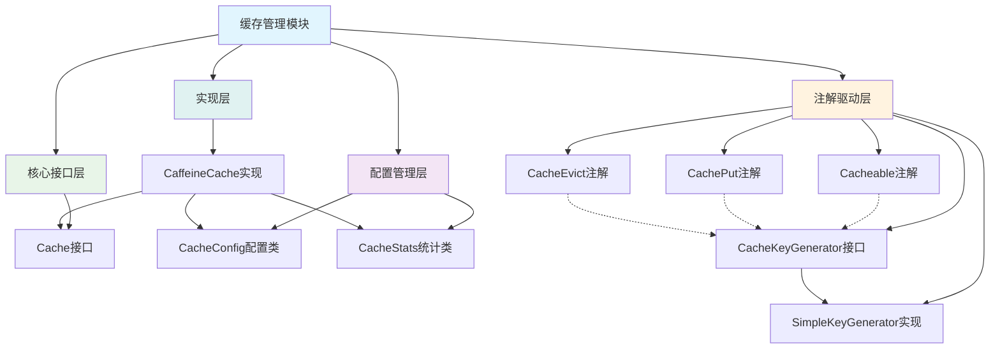

基于对代码的仔细分析，我重新梳理了这个缓存管理模块的架构设计：

## 架构分析

### 1. 核心接口层

- `Cache<K, V>`接口定义了缓存的基本操作规范，包括get、put、remove、统计等核心方法

### 2. 配置管理层

- `CacheConfig`类提供了完整的缓存配置管理，包括：
    - 基础配置：缓存名称、大小限制、过期策略
    - 统计配置：是否记录统计信息
    - 保护机制：缓存穿透、击穿、雪崩保护配置
    - 缓存类型：支持本地、分布式、混合三种缓存类型
- [CacheStats](file://E:\dossier\others\im-common\src\main\java\com\qtech\im\cache\CacheStats.java#L14-L145)类负责收集和统计缓存使用情况，包括命中率、加载时间等关键指标

### 3. 注解驱动层

- 三个核心注解提供了声明式缓存支持：
    - [@Cacheable](file://E:\dossier\others\im-common\src\main\java\com\qtech\im\cache\annotation\Cacheable.java#L25-L79)：用于缓存方法结果
    - [@CachePut](file://E:\dossier\others\im-common\src\main\java\com\qtech\im\cache\annotation\CachePut.java#L15-L62)：用于更新缓存
    - [@CacheEvict](file://E:\dossier\others\im-common\src\main\java\com\qtech\im\cache\annotation\CacheEvict.java#L14-L54)：用于清除缓存
- 键生成机制：
    - [CacheKeyGenerator](file://E:\dossier\others\im-common\src\main\java\com\qtech\im\cache\annotation\CacheKeyGenerator.java#L15-L26)接口定义了键生成规范
    - [SimpleKeyGenerator](file://E:\dossier\others\im-common\src\main\java\com\qtech\im\cache\annotation\SimpleKeyGenerator.java#L16-L49)提供了基于类名、方法名和参数的默认键生成策略

### 4. 实现层

- [CaffeineCache](file://E:\dossier\others\im-common\src\main\java\com\qtech\im\cache\impl\CaffeineCache.java#L27-L212)是基于Caffeine库的具体实现：
    - 实现了[Cache](file://E:\dossier\others\im-common\src\main\java\com\qtech\im\cache\Cache.java#L20-L142)接口的所有方法
    - 集成了[CacheConfig](file://E:\dossier\others\im-common\src\main\java\com\qtech\im\cache\CacheConfig.java#L15-L186)配置
    - 使用[CacheStats](file://E:\dossier\others\im-common\src\main\java\com\qtech\im\cache\CacheStats.java#L14-L145)收集统计信息
    - 支持Caffeine的各种特性如大小限制、过期策略等

### 关系说明

- 实线表示直接依赖关系
- 虚线表示注解引用关系
- [CaffeineCache](file://E:\dossier\others\im-common\src\main\java\com\qtech\im\cache\impl\CaffeineCache.java#L27-L212)同时依赖接口、配置和统计类
- 注解通过[CacheKeyGenerator](file://E:\dossier\others\im-common\src\main\java\com\qtech\im\cache\annotation\CacheKeyGenerator.java#L15-L26)接口与具体实现解耦

这个架构设计体现了良好的分层和解耦思想，便于扩展和维护。